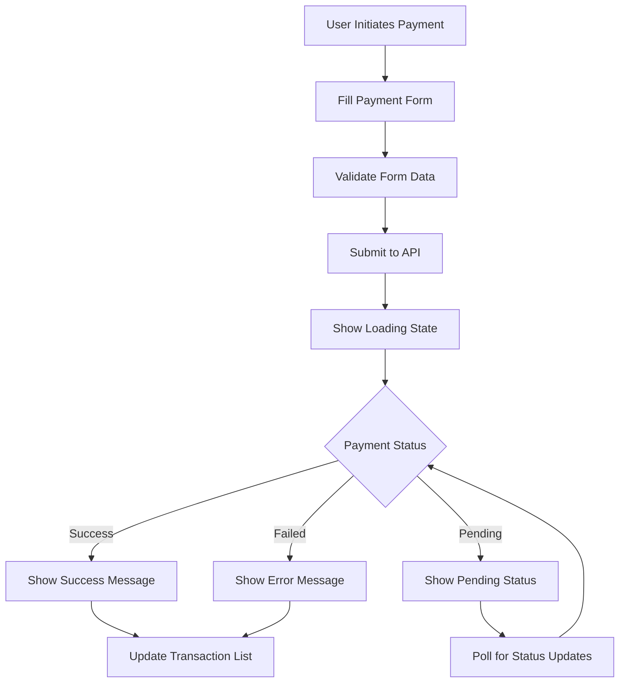
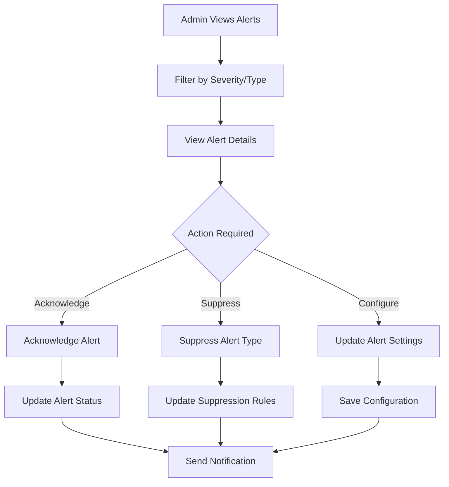
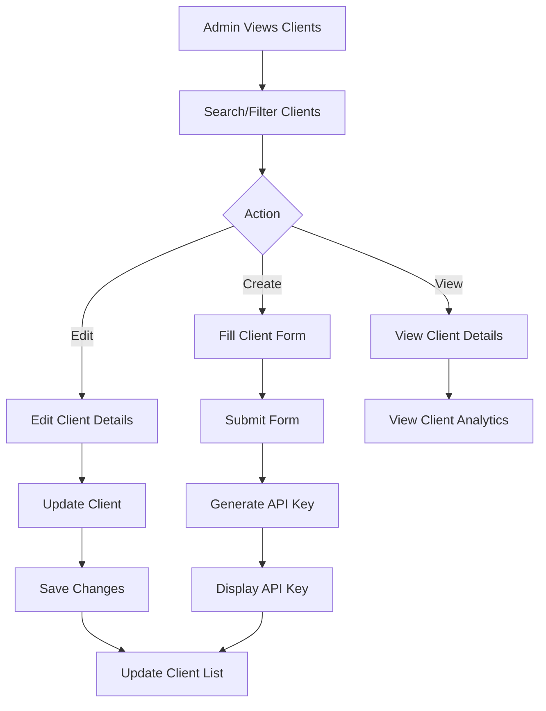

# NPS (Nigerian Payment Stack) Frontend Product Document

## 📋 **Executive Summary**

The NPS system is a comprehensive payment processing platform that integrates with NIBSS (Nigerian Inter-Bank Settlement System) to provide real-time payment services, identification verification, and financial transaction management. This document outlines the complete frontend implementation plan, API specifications, and user experience requirements.

## 🎯 **Product Overview**

### **Core Business Capabilities**
- **Real-time Payment Processing** (PACS.008, PACS.002, PACS.028)
- **Account Verification** (ACMT.023, ACMT.024)
- **Multi-client Management** with JWT authentication
- **Comprehensive Alert & Monitoring System**
- **Advanced Analytics & Reporting Dashboard**
- **System Health Monitoring & Management**
- **Webhook & Integration Management**
- **Rate Limiting & API Management**
- **Audit Trail & Compliance**
- **Notification Management** (Email, Slack, Webhooks)
- **User Profile & Authentication Management**

### **Target Users**
1. **System Administrators** - Full system control and monitoring
2. **Client Administrators** - Client-specific management
3. **Operations Team** - Daily monitoring and alert management
4. **Compliance Team** - Audit and reporting access

---

## 🏗️ **System Architecture Overview**

### **Authentication & Authorization**
- **JWT Token Authentication** for secure client access
- **Role-based Access Control** (RBAC) with granular permissions
- **Admin vs Client separation** with different access levels
- **Session management** with token refresh capabilities
- **Password reset** and user profile management
- **Multi-factor authentication** support

### **Message Types Supported**
| Message Type | Purpose | Direction | Status |
|-------------|---------|-----------|--------|
| **PACS.008** | Payment Request | Outbound/Inbound | ✅ Complete |
| **PACS.002** | Payment Status Report | Outbound/Inbound | ✅ Complete |
| **PACS.028** | Payment Status Request | Outbound/Inbound | ✅ Complete |
| **ACMT.023** | Account Verification Request | Outbound | ✅ Complete |
| **ACMT.024** | Account Verification Report | Inbound | ✅ Complete |

---

## 🎨 **Frontend Application Structure**

### **1. Main Dashboard Application**
```
📱 NPS Admin Dashboard
├── 🏠 Dashboard Overview
├── 💰 Payment Management
├── 🔍 Account Verification
├── 🚨 Alert Management
├── 📊 Analytics & Reports
├── 👥 Client Management
├── ⚙️ System Configuration
└── 📋 Audit Logs
```

### **2. Client Portal Application**
```
📱 NPS Client Portal
├── 🏠 Client Dashboard
├── 💰 Payment Operations
├── 🔍 Account Verification
├── 📊 Transaction History
├── 🔑 API Management
└── 📋 Activity Logs
```

---

## 🔌 **Complete API Specification**

### **🔐 Authentication & User Management APIs**

#### **Client Authentication**
```http
POST /api/v1/auth/login
Content-Type: application/json

{
  "clientId": "string",
  "apiKey": "string"
}

Response:
{
  "token": "jwt_token",
  "clientId": "string",
  "clientName": "string",
  "clientType": "BANK|FIN|PAY",
  "permissions": ["PAYMENT_INITIATE", "PAYMENT_VIEW", "ACCOUNT_VERIFY"],
  "expiresAt": "2024-01-01T00:00:00Z",
  "refreshToken": "refresh_token"
}
```

#### **Token Refresh**
```http
POST /api/v1/auth/refresh
Authorization: Bearer {token}

Response:
{
  "token": "new_jwt_token",
  "expiresAt": "2024-01-01T00:00:00Z"
}
```

#### **User Profile Management**
```http
GET /api/v1/auth/profile
Authorization: Bearer {token}

Response:
{
  "id": "string",
  "clientName": "string",
  "email": "string",
  "phone": "string",
  "clientType": "BANK",
  "isActive": true,
  "lastLogin": "2024-01-01T00:00:00Z",
  "createdAt": "2024-01-01T00:00:00Z"
}

PUT /api/v1/auth/profile
Authorization: Bearer {token}
Content-Type: application/json

{
  "clientName": "string",
  "email": "string",
  "phone": "string"
}
```

#### **Password Management**
```http
POST /api/v1/auth/change-password
Authorization: Bearer {token}
Content-Type: application/json

{
  "currentPassword": "string",
  "newPassword": "string",
  "confirmPassword": "string"
}

POST /api/v1/auth/forgot-password
Content-Type: application/x-www-form-urlencoded

email=user@example.com

POST /api/v1/auth/reset-password
Content-Type: application/x-www-form-urlencoded

token=reset_token&newPassword=new_password
```

#### **Logout**
```http
POST /api/v1/auth/logout
Authorization: Bearer {token}

Response:
{
  "message": "Logged out successfully"
}
```

### **💰 Payment Management APIs**

#### **Initiate Payment (PACS.008)**
```http
POST /api/v1/payments/initiate
Authorization: Bearer {token}
Content-Type: application/json

{
  "transactionId": "string",
  "amount": "1000.00",
  "currency": "NGN",
  "debtorAccount": "string",
  "creditorAccount": "string",
  "debtorBankCode": "string",
  "creditorBankCode": "string",
  "narration": "string",
  "reference": "string"
}

Response:
{
  "transactionId": "string",
  "messageId": "string",
  "status": "PENDING|SUCCESS|FAILED",
  "responseCode": "string",
  "responseMessage": "string",
  "processedAt": "2024-01-01T00:00:00Z"
}
```

#### **Check Payment Status (PACS.028)**
```http
POST /api/v1/payments/status
Authorization: Bearer {token}
Content-Type: application/json

{
  "originalTransactionId": "string",
  "originalMessageId": "string"
}

Response:
{
  "transactionId": "string",
  "status": "PENDING|SUCCESS|FAILED",
  "statusReason": "string",
  "processedAt": "2024-01-01T00:00:00Z"
}
```

#### **Get Payment History**
```http
GET /api/v1/payments/history?page=0&size=20&from=2024-01-01&to=2024-01-31
Authorization: Bearer {token}

Response:
{
  "content": [
    {
      "transactionId": "string",
      "amount": "1000.00",
      "currency": "NGN",
      "status": "SUCCESS",
      "debtorAccount": "string",
      "creditorAccount": "string",
      "createdAt": "2024-01-01T00:00:00Z",
      "processedAt": "2024-01-01T00:00:00Z"
    }
  ],
  "totalElements": 100,
  "totalPages": 5,
  "currentPage": 0
}
```

### **🔍 Account Verification APIs**

#### **Verify Account (ACMT.023)**
```http
POST /api/v1/identification/verify
Authorization: Bearer {token}
Content-Type: application/json

{
  "accountNumber": "string",
  "bankCode": "string",
  "accountName": "string"
}

Response:
{
  "messageId": "string",
  "status": "SUCCESS|FAILED",
  "accountVerified": true,
  "accountName": "string",
  "bankCode": "string",
  "processedAt": "2024-01-01T00:00:00Z"
}
```

### **🚨 Alert Management APIs**

#### **Get Alert Configuration**
```http
GET /api/v1/admin/alerts/config
Authorization: Bearer {admin_token}

Response:
{
  "enabledMessageTypes": ["PACS008", "PACS002", "ACMT023"],
  "suppressedAlertTypes": [],
  "isSuppressed": false,
  "suppressionEndTime": null,
  "maxAlertsPerHour": 100
}
```

#### **Suppress Alerts**
```http
POST /api/v1/admin/alerts/suppress?hours=2&reason=Maintenance&suppressedBy=admin
Authorization: Bearer {admin_token}

Response:
{
  "message": "Alerts suppressed successfully",
  "suppressedUntil": "2024-01-01T02:00:00Z",
  "reason": "Maintenance",
  "suppressedBy": "admin"
}
```

#### **Get Alert Analytics**
```http
GET /api/v1/admin/alerts/analytics
Authorization: Bearer {admin_token}

Response:
{
  "totalAlerts": 150,
  "enabledMessageTypes": ["PACS008", "PACS002"],
  "alertCountsByType": {
    "PACS008_CRITICAL": 25,
    "PACS002_WARNING": 10
  },
  "lastAlertTimes": {
    "PACS008_CRITICAL": "2024-01-01T10:30:00Z"
  }
}
```

#### **Get Recent Alerts**
```http
GET /api/v1/admin/alerts/recent?limit=50
Authorization: Bearer {admin_token}

Response:
{
  "content": [
    {
      "id": 1,
      "name": "PACS008 Processing Failure",
      "message": "Error processing PACS.008 message",
      "severity": "CRITICAL",
      "status": "ACTIVE",
      "createdAt": "2024-01-01T10:30:00Z",
      "context": "{\"messageType\":\"PACS008\",\"transactionId\":\"TXN123\"}"
    }
  ]
}
```

### **👥 Client Management APIs (Admin Only)**

#### **Get All Clients**
```http
GET /api/v1/admin/clients?page=0&size=20
Authorization: Bearer {admin_token}

Response:
{
  "content": [
    {
      "clientId": "string",
      "clientName": "string",
      "clientType": "BANK|FIN|PAY",
      "isActive": true,
      "createdAt": "2024-01-01T00:00:00Z",
      "lastActivity": "2024-01-01T10:00:00Z"
    }
  ],
  "totalElements": 10,
  "totalPages": 1
}
```

#### **Create New Client**
```http
POST /api/v1/admin/clients
Authorization: Bearer {admin_token}
Content-Type: application/json

{
  "clientName": "string",
  "clientType": "BANK|FIN|PAY",
  "description": "string",
  "contactEmail": "string",
  "contactPhone": "string"
}

Response:
{
  "clientId": "string",
  "apiKey": "generated_api_key",
  "clientName": "string",
  "clientType": "BANK",
  "isActive": true,
  "createdAt": "2024-01-01T00:00:00Z"
}
```

#### **Regenerate API Key**
```http
POST /api/v1/admin/clients/{clientId}/regenerate-key
Authorization: Bearer {admin_token}

Response:
{
  "clientId": "string",
  "newApiKey": "new_generated_api_key",
  "regeneratedAt": "2024-01-01T00:00:00Z"
}
```

### **📊 Advanced Analytics & Reporting APIs**

#### **Generate Custom Reports**
```http
POST /api/v1/admin/reports/generate
Authorization: Bearer {admin_token}
Content-Type: application/json

{
  "reportType": "transaction_summary|client_performance|system_health",
  "reportName": "Daily Transaction Summary",
  "description": "Summary of all transactions for today",
  "fromDate": "2024-01-01",
  "toDate": "2024-01-31",
  "clientIds": ["CLIENT001", "CLIENT002"],
  "filters": {
    "status": "SUCCESS",
    "amountRange": {"min": 1000, "max": 10000}
  },
  "groupBy": "client|date|status",
  "format": "json|csv|xlsx|pdf"
}

Response:
{
  "reportId": "RPT001",
  "reportName": "Daily Transaction Summary",
  "reportType": "transaction_summary",
  "status": "COMPLETED",
  "data": [...],
  "summary": {...},
  "metadata": {...},
  "downloadUrl": "/api/v1/admin/reports/export/RPT001"
}
```

#### **Export Reports**
```http
GET /api/v1/admin/reports/export/{reportId}?format=csv
Authorization: Bearer {admin_token}

Response: File download (CSV, Excel, PDF, JSON)
```

#### **Report Templates**
```http
GET /api/v1/admin/reports/templates
Authorization: Bearer {admin_token}

Response:
[
  {
    "id": "transaction_summary",
    "name": "Transaction Summary Report",
    "description": "Summary of all transactions for a given period",
    "category": "transactions",
    "parameters": ["fromDate", "toDate", "clientId"]
  }
]
```

#### **Scheduled Reports**
```http
POST /api/v1/admin/reports/schedule
Authorization: Bearer {admin_token}
Content-Type: application/json

{
  "reportType": "transaction_summary",
  "reportName": "Daily Transaction Summary",
  "schedule": {
    "enabled": true,
    "frequency": "DAILY|WEEKLY|MONTHLY",
    "time": "09:00",
    "recipients": ["admin@example.com"]
  }
}

GET /api/v1/admin/reports/scheduled
DELETE /api/v1/admin/reports/scheduled/{scheduleId}
```

#### **Real-time Metrics**
```http
GET /api/v1/admin/reports/metrics/realtime
Authorization: Bearer {admin_token}

Response:
{
  "systemUptime": "99.9%",
  "activeConnections": 150,
  "memoryUsage": "75%",
  "cpuUsage": "45%",
  "transactionsToday": 1250,
  "successRate": 98.5,
  "averageResponseTime": 2.3,
  "activeClients": 25,
  "lastUpdated": "2024-01-01T10:30:00Z"
}
```

#### **Performance Metrics**
```http
GET /api/v1/admin/reports/metrics/performance?from=2024-01-01&to=2024-01-31
Authorization: Bearer {admin_token}

Response:
{
  "averageResponseTime": 2.1,
  "p95ResponseTime": 5.8,
  "p99ResponseTime": 12.3,
  "throughput": 150.5,
  "errorRate": 0.5,
  "timeSeries": [...]
}
```

#### **Report History**
```http
GET /api/v1/admin/reports/history?page=0&size=20&from=2024-01-01&to=2024-01-31
Authorization: Bearer {admin_token}

Response:
[
  {
    "reportId": "RPT001",
    "reportName": "Daily Transaction Summary",
    "reportType": "transaction_summary",
    "status": "COMPLETED",
    "createdAt": "2024-01-01T09:00:00Z",
    "createdBy": "admin"
  }
]
```

### **🔗 Integration & Webhook Management APIs**

#### **Webhook Configuration**
```http
GET /api/v1/admin/integrations/webhooks
Authorization: Bearer {admin_token}

POST /api/v1/admin/integrations/webhooks
Authorization: Bearer {admin_token}
Content-Type: application/json

{
  "name": "Payment Success Webhook",
  "url": "https://example.com/webhook",
  "apiKey": "webhook_api_key",
  "eventTypes": ["PAYMENT_SUCCESS", "PAYMENT_FAILED"],
  "isActive": true,
  "retryAttempts": 3,
  "timeoutSeconds": 30,
  "description": "Webhook for payment notifications"
}

PUT /api/v1/admin/integrations/webhooks/{webhookId}
DELETE /api/v1/admin/integrations/webhooks/{webhookId}
```

#### **Webhook Testing & Delivery**
```http
POST /api/v1/admin/integrations/webhooks/{webhookId}/test
Authorization: Bearer {admin_token}

Response:
{
  "success": true,
  "response": "OK",
  "responseTime": 150,
  "timestamp": "2024-01-01T10:30:00Z"
}

GET /api/v1/admin/integrations/webhooks/{webhookId}/deliveries?page=0&size=20
POST /api/v1/admin/integrations/webhooks/{webhookId}/deliveries/{deliveryId}/retry
```

#### **Rate Limiting Management**
```http
GET /api/v1/admin/integrations/rate-limits
Authorization: Bearer {admin_token}

PUT /api/v1/admin/integrations/rate-limits/{clientId}
Authorization: Bearer {admin_token}
Content-Type: application/json

{
  "hourlyLimit": 1000,
  "dailyLimit": 10000,
  "burstLimit": 100
}

GET /api/v1/admin/integrations/rate-limits/{clientId}/usage
```

#### **Third-party Integrations**
```http
GET /api/v1/admin/integrations/third-party
Authorization: Bearer {admin_token}

POST /api/v1/admin/integrations/third-party
Authorization: Bearer {admin_token}
Content-Type: application/json

{
  "name": "Slack Integration",
  "type": "SLACK",
  "endpoint": "https://hooks.slack.com/services/xxx",
  "apiKey": "slack_api_key",
  "isActive": true,
  "description": "Slack notifications for alerts"
}

POST /api/v1/admin/integrations/third-party/{integrationId}/test
```

### **🖥️ System Monitoring & Health APIs**

#### **System Health Monitoring**
```http
GET /api/v1/admin/system/health
Authorization: Bearer {admin_token}

Response:
{
  "status": "HEALTHY|WARNING|CRITICAL",
  "uptime": "99.9%",
  "version": "1.0.0",
  "timestamp": "2024-01-01T10:30:00Z",
  "issues": [],
  "components": {
    "database": "HEALTHY",
    "externalServices": "HEALTHY",
    "memory": "HEALTHY"
  }
}

GET /api/v1/admin/system/metrics
GET /api/v1/admin/system/performance?from=2024-01-01&to=2024-01-31
```

#### **Database & External Services Health**
```http
GET /api/v1/admin/system/database/health
Authorization: Bearer {admin_token}

Response:
{
  "status": "HEALTHY",
  "connectionCount": 15,
  "activeConnections": 8,
  "responseTime": 12,
  "lastCheck": "2024-01-01T10:30:00Z"
}

GET /api/v1/admin/system/external-services/health
```

#### **System Logs & Search**
```http
GET /api/v1/admin/system/logs?page=0&size=50&level=ERROR&source=PaymentService
Authorization: Bearer {admin_token}

GET /api/v1/admin/system/logs/search?query=payment&page=0&size=50
Authorization: Bearer {admin_token}

GET /api/v1/admin/system/logs/statistics?from=2024-01-01&to=2024-01-31
Authorization: Bearer {admin_token}

GET /api/v1/admin/system/logs/export?format=csv&level=ERROR
Authorization: Bearer {admin_token}
```

#### **System Alerts & Configuration**
```http
GET /api/v1/admin/system/alerts?page=0&size=20&severity=WARNING
Authorization: Bearer {admin_token}

POST /api/v1/admin/system/alerts/{alertId}/acknowledge
Authorization: Bearer {admin_token}

GET /api/v1/admin/system/configuration
PUT /api/v1/admin/system/configuration
Authorization: Bearer {admin_token}
Content-Type: application/json

{
  "maxConnections": 200,
  "timeoutSeconds": 60,
  "retryAttempts": 3,
  "logLevel": "INFO"
}
```

### **⚙️ System Configuration APIs**

#### **Get Notification Configuration**
```http
GET /api/v1/admin/notifications/config
Authorization: Bearer {admin_token}

Response:
{
  "emailApiUrl": "http://localhost:8090/live/send-email-without-template",
  "emailSender": "nps@payaza.africa",
  "emailRecipients": "admin@payaza.africa",
  "slackWebhookUrl": "https://hooks.slack.com/...",
  "webhookUrl": "https://webhook.site/...",
  "maxRetryAttempts": 3,
  "retryIntervalSeconds": 300
}
```

#### **Update Notification Settings**
```http
PUT /api/v1/admin/notifications/config/email
Authorization: Bearer {admin_token}
Content-Type: application/x-www-form-urlencoded

recipients=admin@payaza.africa,ops@payaza.africa

Response:
{
  "message": "Email recipients updated successfully"
}
```

### **📋 Audit & Compliance APIs**

#### **Get Audit Logs**
```http
GET /api/v1/admin/audit/logs?page=0&size=50&from=2024-01-01&to=2024-01-31
Authorization: Bearer {admin_token}

Response:
{
  "content": [
    {
      "id": 1,
      "action": "PACS008_INITIATE",
      "resource": "Payment",
      "clientId": "CLIENT123",
      "timestamp": "2024-01-01T10:30:00Z",
      "ipAddress": "192.168.1.1",
      "userAgent": "Mozilla/5.0...",
      "success": true
    }
  ],
  "totalElements": 1000,
  "totalPages": 20
}
```

---

## 🎨 **UI/UX Design Requirements**

### **1. Design System**

#### **Color Palette**
```css
/* Primary Colors */
--primary-blue: #1e40af;
--primary-blue-light: #3b82f6;
--primary-blue-dark: #1e3a8a;

/* Status Colors */
--success-green: #10b981;
--warning-orange: #f59e0b;
--error-red: #ef4444;
--info-blue: #06b6d4;

/* Neutral Colors */
--gray-50: #f9fafb;
--gray-100: #f3f4f6;
--gray-200: #e5e7eb;
--gray-300: #d1d5db;
--gray-400: #9ca3af;
--gray-500: #6b7280;
--gray-600: #4b5563;
--gray-700: #374151;
--gray-800: #1f2937;
--gray-900: #111827;
```

#### **Typography**
```css
/* Font Family */
font-family: 'Inter', -apple-system, BlinkMacSystemFont, 'Segoe UI', sans-serif;

/* Font Sizes */
--text-xs: 0.75rem;    /* 12px */
--text-sm: 0.875rem;   /* 14px */
--text-base: 1rem;     /* 16px */
--text-lg: 1.125rem;   /* 18px */
--text-xl: 1.25rem;    /* 20px */
--text-2xl: 1.5rem;    /* 24px */
--text-3xl: 1.875rem;  /* 30px */
--text-4xl: 2.25rem;   /* 36px */
```

### **2. Component Library**

#### **Core Components**
- **Button** (Primary, Secondary, Danger, Ghost)
- **Input** (Text, Number, Email, Password, Search)
- **Select** (Single, Multi-select, Searchable)
- **Table** (Sortable, Filterable, Paginated)
- **Modal** (Confirmation, Form, Info)
- **Alert** (Success, Warning, Error, Info)
- **Card** (Basic, Stat, Chart)
- **Badge** (Status, Count, Custom)
- **Tabs** (Horizontal, Vertical)
- **Sidebar** (Collapsible, Multi-level)
- **Header** (Fixed, Sticky, Responsive)

#### **Data Visualization Components**
- **Line Chart** (Transaction trends, Response times)
- **Bar Chart** (Volume by day, Success rates)
- **Pie Chart** (Transaction status distribution)
- **Gauge Chart** (System health, Success rate)
- **Data Table** (Sortable, Filterable, Exportable)
- **KPI Cards** (Total transactions, Volume, Success rate)

### **3. Layout Structure**

#### **Admin Dashboard Layout**
```
┌─────────────────────────────────────────────────────────┐
│ 🏠 NPS Admin Dashboard                    👤 Admin User │
├─────────────────────────────────────────────────────────┤
│ 📊 Dashboard │ 💰 Payments │ 🔍 Verify │ 🚨 Alerts │ 📊 Analytics │ 👥 Clients │ ⚙️ Config │
├─────────────────────────────────────────────────────────┤
│                                                         │
│                    Main Content Area                    │
│                                                         │
│                                                         │
└─────────────────────────────────────────────────────────┘
```

#### **Client Portal Layout**
```
┌─────────────────────────────────────────────────────────┐
│ 🏠 NPS Client Portal                      👤 Client User │
├─────────────────────────────────────────────────────────┤
│ 📊 Dashboard │ 💰 Payments │ 🔍 Verify │ 📊 History │ 🔑 API │
├─────────────────────────────────────────────────────────┤
│                                                         │
│                    Main Content Area                    │
│                                                         │
│                                                         │
└─────────────────────────────────────────────────────────┘
```

---

## 📱 **Page Specifications**

### **1. Dashboard Overview**

#### **Admin Dashboard**
```typescript
interface AdminDashboardData {
  systemHealth: {
    status: 'HEALTHY' | 'WARNING' | 'CRITICAL';
    uptime: string;
    responseTime: number;
  };
  transactionMetrics: {
    totalToday: number;
    successfulToday: number;
    failedToday: number;
    totalVolume: string;
    successRate: number;
  };
  clientMetrics: {
    activeClients: number;
    totalClients: number;
    newClientsThisMonth: number;
  };
  alertMetrics: {
    activeAlerts: number;
    criticalAlerts: number;
    resolvedToday: number;
  };
  recentActivity: ActivityItem[];
}
```

#### **Client Dashboard**
```typescript
interface ClientDashboardData {
  transactionMetrics: {
    totalToday: number;
    successfulToday: number;
    failedToday: number;
    totalVolume: string;
    successRate: number;
  };
  recentTransactions: Transaction[];
  accountVerifications: Verification[];
  apiUsage: {
    requestsToday: number;
    requestsThisMonth: number;
    rateLimitRemaining: number;
  };
}
```

### **2. Payment Management**

#### **Payment Initiation Form**
```typescript
interface PaymentFormData {
  transactionId: string;
  amount: string;
  currency: 'NGN';
  debtorAccount: string;
  creditorAccount: string;
  debtorBankCode: string;
  creditorBankCode: string;
  narration: string;
  reference: string;
}
```

#### **Payment History Table**
```typescript
interface PaymentHistoryItem {
  transactionId: string;
  amount: string;
  currency: string;
  status: 'PENDING' | 'SUCCESS' | 'FAILED';
  debtorAccount: string;
  creditorAccount: string;
  createdAt: string;
  processedAt?: string;
  responseCode?: string;
  responseMessage?: string;
}
```

### **3. Alert Management**

#### **Alert Configuration Panel**
```typescript
interface AlertConfiguration {
  enabledMessageTypes: string[];
  suppressedAlertTypes: string[];
  isSuppressed: boolean;
  suppressionEndTime?: string;
  suppressionReason?: string;
  maxAlertsPerHour: number;
}
```

#### **Alert Analytics Dashboard**
```typescript
interface AlertAnalytics {
  totalAlerts: number;
  alertCountsByType: Record<string, number>;
  lastAlertTimes: Record<string, string>;
  alertTrends: {
    date: string;
    count: number;
    severity: string;
  }[];
}
```

### **4. Client Management**

#### **Client List Table**
```typescript
interface ClientItem {
  clientId: string;
  clientName: string;
  clientType: 'BANK' | 'FIN' | 'PAY';
  isActive: boolean;
  createdAt: string;
  lastActivity?: string;
  totalTransactions: number;
  successRate: number;
}
```

#### **Client Creation Form**
```typescript
interface ClientFormData {
  clientName: string;
  clientType: 'BANK' | 'FIN' | 'PAY';
  description: string;
  contactEmail: string;
  contactPhone: string;
}
```

---

## 🔧 **Technical Implementation Requirements**

### **1. Frontend Technology Stack**

#### **Recommended Stack**
- **Framework**: React 18+ with TypeScript
- **State Management**: Redux Toolkit + RTK Query
- **UI Library**: Material-UI (MUI) or Ant Design
- **Charts**: Chart.js or Recharts
- **Forms**: React Hook Form + Yup validation
- **HTTP Client**: Axios with interceptors
- **Routing**: React Router v6
- **Build Tool**: Vite or Create React App
- **Testing**: Jest + React Testing Library

#### **Alternative Stack**
- **Framework**: Vue 3 + TypeScript
- **State Management**: Pinia
- **UI Library**: Vuetify or Element Plus
- **Charts**: Chart.js or ECharts
- **Forms**: VeeValidate
- **HTTP Client**: Axios
- **Routing**: Vue Router v4
- **Build Tool**: Vite

### **2. State Management Architecture**

```typescript
// Redux Store Structure
interface RootState {
  auth: AuthState;
  payments: PaymentState;
  alerts: AlertState;
  clients: ClientState;
  analytics: AnalyticsState;
  ui: UIState;
}

interface AuthState {
  user: User | null;
  token: string | null;
  isAuthenticated: boolean;
  permissions: string[];
}

interface PaymentState {
  transactions: Transaction[];
  currentTransaction: Transaction | null;
  loading: boolean;
  error: string | null;
}

interface AlertState {
  alerts: Alert[];
  configuration: AlertConfiguration;
  analytics: AlertAnalytics;
  loading: boolean;
}
```

### **3. API Integration**

#### **API Client Setup**
```typescript
// API Client Configuration
const apiClient = axios.create({
  baseURL: process.env.REACT_APP_API_BASE_URL,
  timeout: 30000,
  headers: {
    'Content-Type': 'application/json',
  },
});

// Request Interceptor
apiClient.interceptors.request.use(
  (config) => {
    const token = localStorage.getItem('authToken');
    if (token) {
      config.headers.Authorization = `Bearer ${token}`;
    }
    return config;
  },
  (error) => Promise.reject(error)
);

// Response Interceptor
apiClient.interceptors.response.use(
  (response) => response,
  (error) => {
    if (error.response?.status === 401) {
      // Handle unauthorized access
      localStorage.removeItem('authToken');
      window.location.href = '/login';
    }
    return Promise.reject(error);
  }
);
```

### **4. Real-time Updates**

#### **WebSocket Integration**
```typescript
// WebSocket Service
class WebSocketService {
  private ws: WebSocket | null = null;
  
  connect(token: string) {
    this.ws = new WebSocket(`wss://api.nps.com/ws?token=${token}`);
    
    this.ws.onmessage = (event) => {
      const data = JSON.parse(event.data);
      this.handleMessage(data);
    };
  }
  
  private handleMessage(data: any) {
    switch (data.type) {
      case 'ALERT_CREATED':
        // Update alert state
        break;
      case 'TRANSACTION_UPDATED':
        // Update transaction state
        break;
      case 'SYSTEM_STATUS':
        // Update system health
        break;
    }
  }
}
```

---

## 📊 **Data Flow & User Journeys**

### **1. Payment Processing Journey**



### **2. Alert Management Journey**



### **3. Client Management Journey**



---

## 🚀 **Implementation Phases**

### **Phase 1: Core Infrastructure (Weeks 1-2)**
- [ ] Project setup and configuration
- [ ] Authentication system implementation
- [ ] Basic routing and layout
- [ ] API client setup
- [ ] State management configuration

### **Phase 2: Admin Dashboard (Weeks 3-4)**
- [ ] Dashboard overview page
- [ ] Alert management system
- [ ] Client management interface
- [ ] System configuration panel
- [ ] Basic analytics views

### **Phase 3: Payment Operations (Weeks 5-6)**
- [ ] Payment initiation forms
- [ ] Payment history and tracking
- [ ] Account verification interface
- [ ] Transaction status monitoring
- [ ] Real-time updates

### **Phase 4: Advanced Features (Weeks 7-8)**
- [ ] Advanced analytics and reporting
- [ ] Audit log interface
- [ ] Notification management
- [ ] Export functionality
- [ ] Mobile responsiveness

### **Phase 5: Testing & Optimization (Weeks 9-10)**
- [ ] Unit and integration testing
- [ ] Performance optimization
- [ ] Security testing
- [ ] User acceptance testing
- [ ] Documentation completion

---

## 🔒 **Security Considerations**

### **1. Authentication & Authorization**
- JWT token-based authentication
- Role-based access control (RBAC)
- API key management for clients
- Session timeout handling
- Secure token storage

### **2. Data Protection**
- Input validation and sanitization
- XSS protection
- CSRF protection
- Secure API communication (HTTPS)
- Sensitive data masking

### **3. Compliance**
- Audit trail for all actions
- Data retention policies
- Privacy controls
- Regulatory compliance (PCI DSS, etc.)

---

## 📈 **Performance Requirements**

### **1. Response Times**
- Page load time: < 2 seconds
- API response time: < 500ms
- Real-time updates: < 1 second
- Chart rendering: < 3 seconds

### **2. Scalability**
- Support 100+ concurrent users
- Handle 1000+ transactions per minute
- Real-time alert processing
- Efficient data pagination

### **3. Browser Support**
- Chrome 90+
- Firefox 88+
- Safari 14+
- Edge 90+

---

## 🧪 **Testing Strategy**

### **1. Unit Testing**
- Component testing with React Testing Library
- Service function testing
- Utility function testing
- State management testing

### **2. Integration Testing**
- API integration testing
- User flow testing
- Cross-browser testing
- Mobile responsiveness testing

### **3. End-to-End Testing**
- Complete user journeys
- Payment processing flows
- Alert management workflows
- Admin operations

---

## 📚 **Documentation Requirements**

### **1. Technical Documentation**
- API documentation (OpenAPI/Swagger)
- Component documentation (Storybook)
- Deployment guide
- Configuration guide

### **2. User Documentation**
- User manual for admins
- Client portal guide
- Troubleshooting guide
- FAQ section

### **3. Developer Documentation**
- Code style guide
- Architecture decisions
- Contributing guidelines
- Testing guidelines

---

## 🎯 **Success Metrics**

### **1. User Experience Metrics**
- User satisfaction score > 4.5/5
- Task completion rate > 95%
- Error rate < 2%
- Support ticket reduction > 50%

### **2. Performance Metrics**
- Page load time < 2 seconds
- API response time < 500ms
- System uptime > 99.9%
- Alert response time < 30 seconds

### **3. Business Metrics**
- Transaction processing efficiency
- Client onboarding time reduction
- Operational cost reduction
- Compliance audit success rate

---

## 🔄 **Missing APIs & Future Enhancements**

### **Missing APIs Identified**
1. **User Management APIs**
   - User profile management
   - Password reset functionality
   - User preferences

2. **Advanced Analytics APIs**
   - Custom report generation
   - Data export in multiple formats
   - Scheduled report delivery

3. **Integration APIs**
   - Webhook management
   - Third-party integrations
   - API rate limiting controls

4. **Monitoring APIs**
   - System health checks
   - Performance metrics
   - Log aggregation

### **Future Enhancement Opportunities**
1. **Mobile Application**
   - React Native or Flutter app
   - Push notifications
   - Offline capabilities

2. **Advanced Features**
   - Machine learning for fraud detection
   - Predictive analytics
   - Automated alert resolution

3. **Integration Capabilities**
   - REST API for external systems
   - GraphQL endpoint
   - Event streaming

---

## 📞 **Support & Maintenance**

### **1. Support Structure**
- Level 1: Basic user support
- Level 2: Technical issue resolution
- Level 3: System administration
- Level 4: Development team

### **2. Maintenance Schedule**
- Daily: System health checks
- Weekly: Performance monitoring
- Monthly: Security updates
- Quarterly: Feature updates

### **3. Monitoring & Alerting**
- Application performance monitoring
- Error tracking and reporting
- User activity monitoring
- System resource monitoring

---

This comprehensive product document provides the foundation for building a world-class NPS frontend application that meets all business requirements while delivering an exceptional user experience. The implementation should follow modern web development best practices and prioritize security, performance, and usability.
